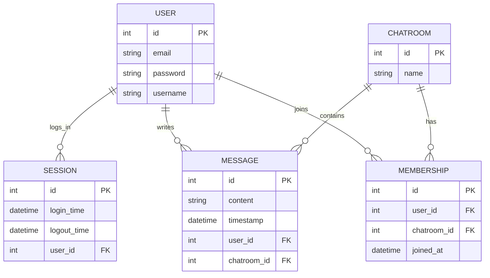

```mermaid
erDiagram

USER {
    int id PK
    string email
    string password
    string username
}

SESSION {
    int id PK
    datetime login_time
    datetime logout_time
    int user_id FK
}

CHATROOM {
    int id PK
    string name
}

MESSAGE {
    int id PK
    string content
    datetime timestamp
    int user_id FK
    int chatroom_id FK
}

MEMBERSHIP {
    int id PK
    int user_id FK
    int chatroom_id FK
    datetime joined_at
}

%% Beziehungen

USER ||--o{ SESSION : logs_in
USER ||--o{ MESSAGE : writes
CHATROOM ||--o{ MESSAGE : contains

USER ||--o{ MEMBERSHIP : joins
CHATROOM ||--o{ MEMBERSHIP : has
```
