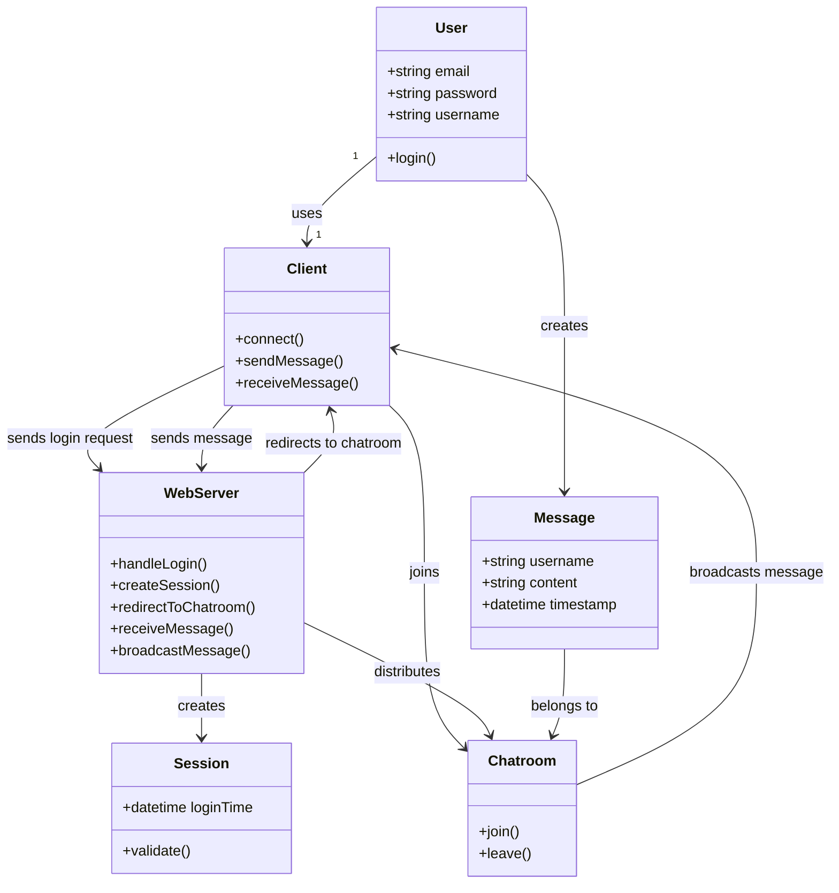

```mermaid
classDiagram

class User {
    +string email
    +string password
    +string username
    +login()
}

class Client {
    +connect()
    +sendMessage()
    +receiveMessage()
}

class WebServer {
    +handleLogin()
    +createSession()
    +redirectToChatroom()
    +receiveMessage()
    +broadcastMessage()
}

class Session {
    +datetime loginTime
    +validate()
}

class Chatroom {
    +join()
    +leave()
}

class Message {
    +string username
    +string content
    +datetime timestamp
}

%% Beziehungen

User "1" --> "1" Client : uses
Client --> WebServer : sends login request
WebServer --> Session : creates
WebServer --> Client : redirects to chatroom

Client --> Chatroom : joins

Client --> WebServer : sends message
WebServer --> Chatroom : distributes
Chatroom --> Client : broadcasts message

User --> Message : creates
Message --> Chatroom : belongs to
```
